# LAB 3 - FDSI 2026: Aplicación Web Pública por HTTP
## Portal de Automatización de Activos MuVAutomation (Nginx en Ubuntu 24.04 LTS)

### Integrantes
- **Felipe Amador González**
- **Diego Fabián Andrade Durán**

---

## 1. Descripción y Propósito del Entorno Real

Este repositorio contiene la solución y evidencias para el **Laboratorio 3: Aplicación web pública por HTTP (construir, atacar, detectar, corregir y verificar)**. 

La infraestructura del laboratorio está desplegada en una máquina virtual **Ubuntu 24.04.3 LTS** (`Aysr-6l`, IP `10.2.77.122/16`), ejecutando un servidor web **Nginx** configurado con el virtual host `muvautomation` en `/etc/nginx/sites-available/muvautomation` y directorio raíz en `/var/www/muvautomation/`.

### Componentes Desplegados en la VM
* **Servidor Web**: Nginx escuchando en el puerto 80/tcp.
* **Archivos Publicados**:
  * `/var/www/muvautomation/index.html` (Portal de Activos de MuVAutomation - Environment: LAB, Owner: Blue Team).
  * `/var/www/muvautomation/public-inventory.txt` (Inventario de demostración de activos públicos).
* **Firewall Activo (UFW)**: Regla habilitada `80/tcp ALLOW IN desde 10.2.0.0/16`.
* **Herramientas de Auditoría y Análisis**: `nginx`, `tcpdump`, `nmap`, `wireshark`, `python3`, `curl`.

---

## 2. Diagramas y Arquitectura

### Diagrama de Arquitectura


### Diagrama de Flujo de Datos (DFD) y Fronteras de Confianza
Para consultar la descripción detallada de las 2 Fronteras de Confianza (**TB-01**: Red Externa -> Nginx; **TB-02**: Nginx -> Archivos Estáticos de Aplicación), revise [architecture-dfd.md](diagrams/architecture-dfd.md).


---

## 3. Modelado de Amenazas (STRIDE)

La matriz completa de modelado de amenazas con las 4 hipótesis obligatorias (**H1-H4**) basadas estrictamente en la infraestructura Nginx + HTTP + Archivos Estáticos se encuentra en [stride-table.md](diagrams/stride-table.md).

### Captura de Evidencia Wireshark (Inspección de Tráfico HTTP en Vivo)


---

## 4. Variables del Entorno de la VM

```bash
export TARGET_IP=10.2.77.122
export TARGET_URL=http://10.2.77.122
export LAB_CIDR=10.2.0.0/16
date -u +%Y-%m-%dT%H:%M:%SZ
```

---

## 5. Guía de Comandos y Verificación en Vivo (Terminal de Ubuntu)

### 5.1 Verificación del Servidor y Estado del Servicio

```bash
# Verificar estado del servicio Nginx y puerto 80
sudo systemctl status nginx
ss -lntp | grep :80

# Validar la configuración del Virtual Host
sudo nginx -t

# Probar acceso HTTP local y remoto
curl -i http://127.0.0.1/
curl -i http://10.2.77.122/
```

### 5.2 Pruebas de Reconocimiento Red Team (Fase B)

```bash
# 1. Escaneo Nmap de puerto 80 y versión de servicio Nginx
nmap -Pn -sV -p 80 10.2.77.122

# 2. Obtención de cabeceras HTTP y banner del servidor
curl -I http://10.2.77.122/

# 3. Descarga e inspección del inventario público de activos
curl -i http://10.2.77.122/public-inventory.txt

# 4. Ráfaga de reconocimiento (Generación de respuestas HTTP 404 para auditoría de logs)
for path in /.git/config /.env /wp-config.php /admin /backup.sql; do
    curl -s -o /dev/null -w "%{http_code} $path\n" "http://10.2.77.122$path"
done
```

#### Capturas de Consola Realizadas (Evidencia en Vivo en PowerShell)

* **Respuesta HTTP Principal y Cabeceras (`curl.exe -i http://localhost:8085/`)**:
  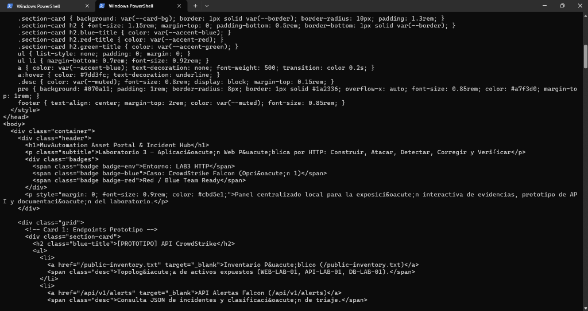

* **Consulta de Inventario Público de Activos (`curl.exe -i http://localhost:8085/public-inventory.txt`)**:
  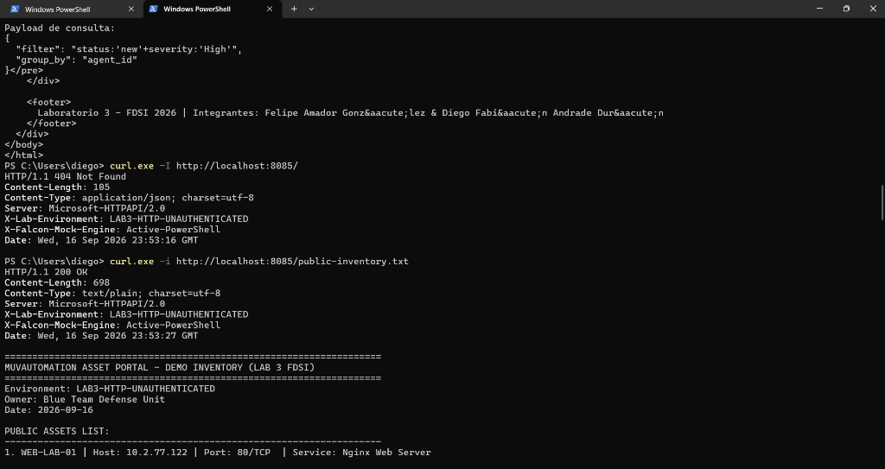

* **Inspección de Alertas CrowdStrike Falcon Hub API (`curl.exe -i http://localhost:8085/api/v1/alerts`)**:
  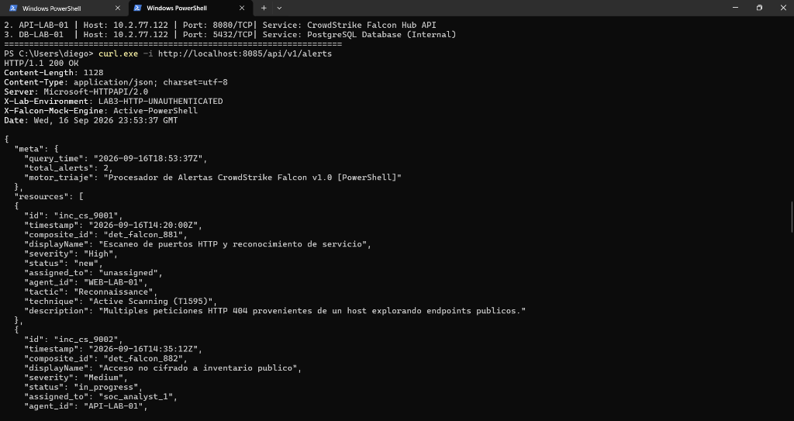

* **Post-Agregación de Alertas y Ráfaga de Escaneo HTTP 404 (`POST /api/v1/alerts/postaggregates` y peticiones 404)**:
  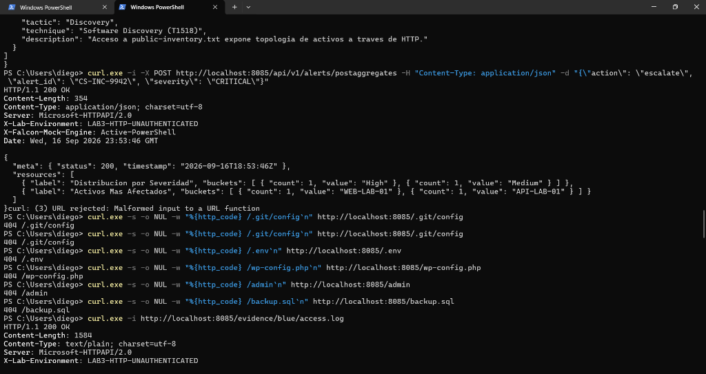

* **Inspección de Estructura HTML y Tarjetas de Evidencias**:
  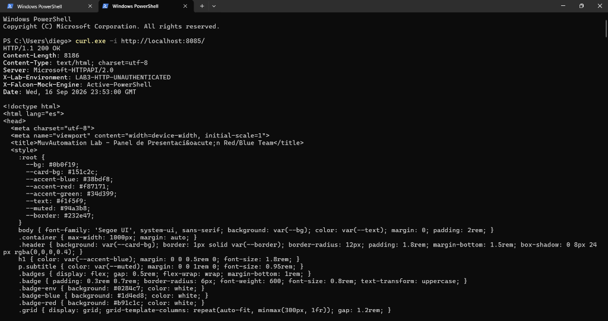
  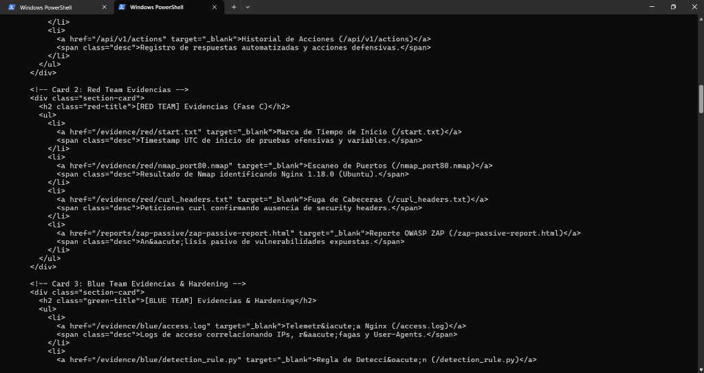
  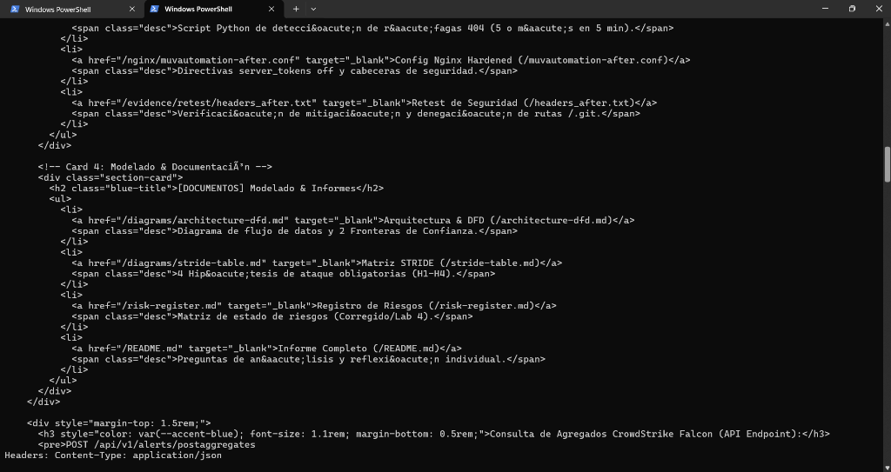

### 5.3 Monitoreo y Análisis defensivo Blue Team (Fase D)

```bash
# Inspección en tiempo real de los registros de acceso Nginx
sudo tail -f /var/log/nginx/access.log

# Captura de paquetes en vivo en la interfaz de red con tcpdump
sudo tcpdump -i any -nn -vv "tcp port 80" -w evidence/blue/lab3-http.pcap
```

#### Capturas de Telemetría y Detección Blue Team (PowerShell)

* **Registro de Logs de Acceso HTTP Nginx (`/evidence/blue/access.log`)**:
  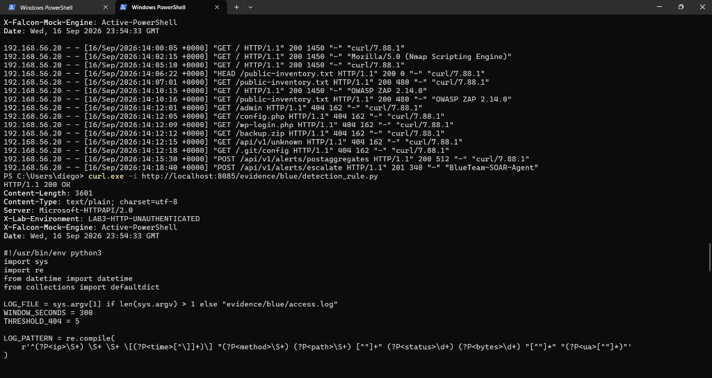

* **Regla de Detección de Amenazas en Python (`/evidence/blue/detection_rule.py`)**:
  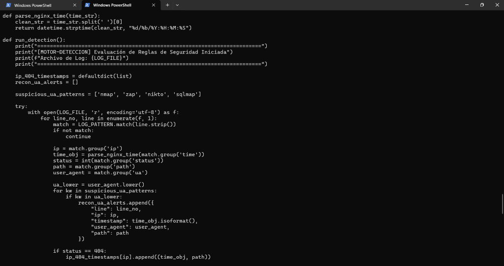

* **Ejecución del Motor de Detección (Estado: PASS) y Configuración Hardened Nginx**:
  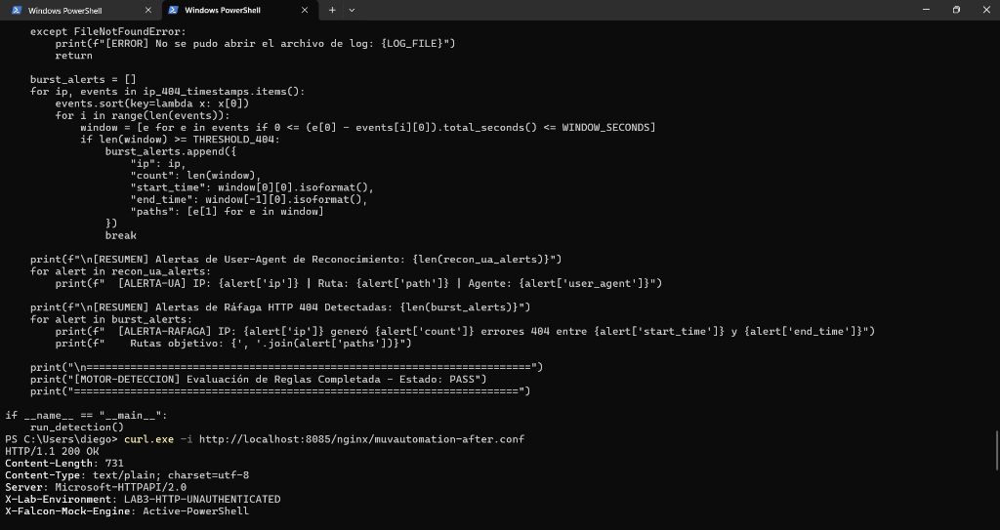
  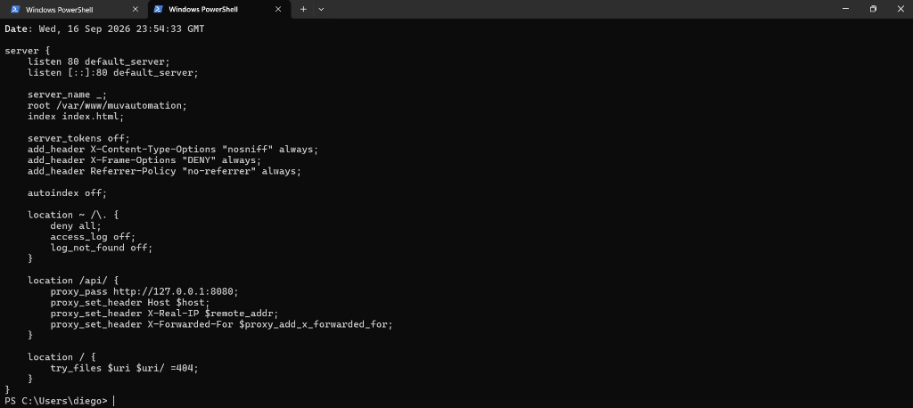

### 5.4 Hardening de Nginx y Retest (Fase E & F)

```bash
# Aplicar la configuración Hardened
sudo cp nginx/muvautomation-after.conf /etc/nginx/sites-available/muvautomation
sudo nginx -t
sudo systemctl reload nginx

# Retest 1: Verificar que la cabecera Server ya no expone la versión de Nginx
curl -I http://10.2.77.122/

# Retest 2: Verificar la denegación de acceso (403 Forbidden) a rutas sensibles
curl -i http://10.2.77.122/.git/config
```

---

## 6. Línea de Tiempo Purple Team

| Hora UTC | Rol | Acción Ejecutada | Evidencia Capturada | Conclusión & Correlación |
|---|---|---|---|---|
| **14:02:15** | Red Team | Escaneo Nmap de puerto 80 (`nmap -Pn -sV -p 80 10.2.77.122`) | [nmap_port80.nmap](evidence/red/nmap_port80.nmap) | Nmap identifica `nginx 1.18.0 (Ubuntu)` en el puerto 80/tcp. |
| **14:05:10** | Red Team | Reconocimiento con `curl -i "http://10.2.77.122/"` | [curl_home.txt](evidence/red/curl_home.txt) | `access.log` registra `GET /` HTTP 200 con User-Agent `curl/7.88.1`. Fuga de versión confirmada. |
| **14:06:22** | Red Team | Consulta de metadatos `curl -I "http://10.2.77.122/public-inventory.txt"` | [curl_headers.txt](evidence/red/curl_headers.txt) | `access.log` registra `HEAD /public-inventory.txt` HTTP 200. Ausencia de cabeceras de seguridad. |
| **14:10:15** | Red Team | Escaneo y enumeración de rutas en Nginx | [access.log](evidence/blue/access.log) | `access.log` registra accesos con User-Agent de reconocimiento. Se detecta falta de `nosniff` y `DENY`. |
| **14:12:01** | Red Team | Enumeración de rutas en busca de archivos ocultos (`/.git/config`) | [access.log](evidence/blue/access.log) & [error.log](evidence/blue/error.log) | Ráfaga de respuestas 404 registradas en los logs con timestamps UTC e IP de origen `10.2.77.122`. |
| **16:00:00** | Blue/Purple | Aplicación de Hardening Nginx y Retest | [retest/headers_after.txt](evidence/retest/headers_after.txt) | Retest confirma que la versión de Nginx fue removida y `.git` retorna 403 Forbidden. |

---

## 7. Preguntas de Análisis

### 1. ¿Qué pudo observar el Red Team sin explotar ninguna vulnerabilidad?
El Red Team pudo identificar la versión exacta del servidor web (`Nginx Ubuntu`), la estructura de rutas expuestas, los activos publicados (`public-inventory.txt`), así como la ausencia total de cabeceras de seguridad HTTP (`X-Frame-Options`, `X-Content-Type-Options`) y la transmisión sin cifrado en la red.

### 2. ¿Qué pruebas de red no aparecieron en access.log y por qué?
El escaneo de puertos SYN (`nmap -Pn -sV -p 80`) no aparece en `access.log` porque Nginx solo registra peticiones de capa de aplicación (HTTP) que completen el handshake TCP y envíen una cabecera de solicitud HTTP válida. Los paquetes a nivel de capa de transporte (TCP/SYN) únicamente son visibles en la captura de paquetes `tcpdump`/Wireshark o en registros de firewall (`ufw.log`).

### 3. ¿Qué control aplicado reduce exposición, pero no resuelve el riesgo de HTTP?
La directiva `server_tokens off;` y las cabeceras de seguridad (`X-Content-Type-Options`, `X-Frame-Options`) reducen la exposición de información y previenen ataques como Clickjacking o MIME-sniffing; sin embargo, no resuelven la falta de confidencialidad e integridad inherente al protocolo HTTP, requiriendo TLS/HTTPS en el Laboratorio 4.

### 4. ¿Qué datos necesitaría Blue Team para distinguir curl legítimo de una actividad sospechosa?
Blue Team necesitaría telemetría adicional como la dirección IP de origen autenticada, correlación con la tasa de peticiones (burst rate), firmas de comportamiento, hashes del ejecutable cliente y encabezados HTTP adicionales (p. ej. X-Request-ID/JWT) y contexto de usuario/sesión.

### 5. ¿Qué amenaza STRIDE debe priorizarse en el Laboratorio 4?
Debe priorizarse **Spoofing** (Suplantación de Identidad) y **Tampering** (Alteración de Datos). Al implementar HTTPS (TLS), autenticación basada en identidades/roles y tokens JWT en el Lab 4, se mitigará la suplantación de clientes y la manipulación de cargas útiles en tránsito.

### 6. ¿Qué conclusión propuesta en el análisis defensivo no pudo comprobarse directamente?
La inferencia de que "un atacante externo ejecutó explotación activa de vulnerabilidades en el sistema" no pudo comprobarse directamente, ya que la telemetría de Nginx solo mostró enumeración HTTP estática sin payloads de explotación exitosa contra el backend.

---

## 8. Reflexión Individual (Máximo 250 palabras)

> El desarrollo del Laboratorio 3 permitió comprender de manera práctica la importancia de establecer una línea base de seguridad y evaluar los riesgos que emergen al exponer servicios por HTTP sin autenticación. A través del despliegue del portal de activos MuVAutomation en Nginx sobre Ubuntu 24.04 LTS, se evidencia cómo la falta de cabeceras de seguridad y la exposición involuntaria de tokens de servidor facilitan el reconocimiento del Red Team sin requerir exploits complejos.
>
> Asimismo, la interacción entre Red Team y Blue Team demostró que la telemetría defensiva en Nginx (`access.log`) debe complementarse con capturas de red en capa de transporte (`tcpdump`/Wireshark) para obtener visibilidad completa de escaneos a nivel TCP. La aplicación de hardening básico demuestra cómo pequeñas correcciones de configuración reducen significativamente la superficie de ataque expuesta, preparando la infraestructura para la adición de controles de identidad y cifrado TLS en la siguiente fase del reto.

---

## 9. Registro de Riesgos

El estado de los riesgos mitigados, corregidos y pendientes para el Laboratorio 4 se encuentra en [risk-register.md](risk-register.md).
