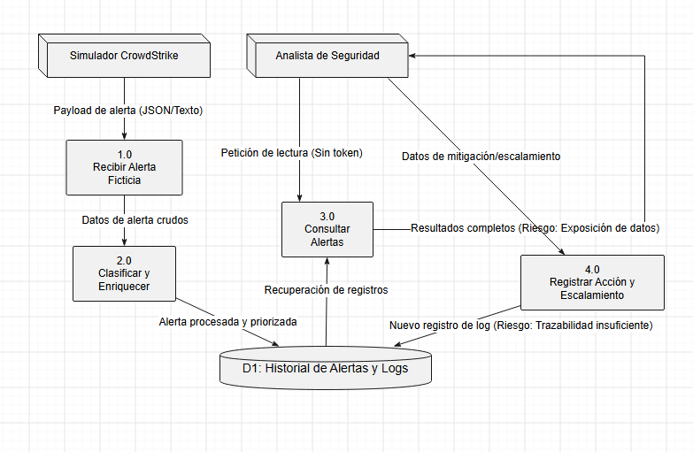
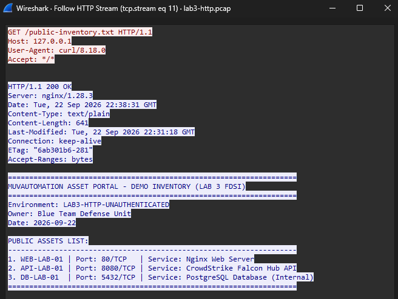

# LAB 3 - FDSI 2026: Aplicación Web Pública por HTTP
## Portal de Automatización de Activos MuVAutomation (Nginx en Ubuntu WSL2)

### Integrantes
- **Diego Fabián Andrade Durán**
- **Felipe Amador González**

---

## 1. Descripción y Propósito del Entorno

Este repositorio contiene la solución, telemetría y evidencias para el **Laboratorio 3: Aplicación web pública por HTTP (construir, atacar, detectar, corregir y verificar)** correspondiente al *Secure Product Challenge*.

La infraestructura del laboratorio está desplegada en **Ubuntu Linux (WSL2 con systemd)**, ejecutando un servidor web **Nginx 1.28.3** configurado con el virtual host `muvautomation` en `/etc/nginx/sites-available/muvautomation` y directorio raíz en `/var/www/muvautomation/`.

### Componentes Desplegados
* **Servidor Web**: Nginx escuchando en el puerto 80/tcp (`0.0.0.0:80` y `[::]:80`).
* **Archivos Publicados**:
  * `/var/www/muvautomation/index.html` (Portal de Activos de MuVAutomation - Environment: LAB, Owner: Blue Team).
  * `/var/www/muvautomation/public-inventory.txt` (Inventario de demostración de activos públicos).
* **Firewall Activo (UFW)**: Reglas habilitadas para el segmento de laboratorio.
* **Herramientas de Auditoría y Telemetría**: `nginx`, `tcpdump`, `nmap`, `wireshark`, `python3`, `curl`.

---

## 2. Diagramas y Arquitectura

### Diagrama de Arquitectura


### Diagrama de Flujo de Datos (DFD) y Fronteras de Confianza
El modelo cuenta con 2 Fronteras de Confianza:
* **TB-01**: Perímetro de Red Externa -> Proceso Nginx (Capa de Red/Transporte).
* **TB-02**: Nginx Worker -> Sistema de Archivos Estáticos (Capa de Aplicación).

Para consultar la descripción detallada, revise [architecture-dfd.md](diagrams/architecture-dfd.md).



---

## 3. Modelado de Amenazas (STRIDE) y Evidencias en Vivo

La matriz completa de modelado de amenazas con las 4 hipótesis obligatorias (**H1-H4**) se encuentra en [stride-table.md](diagrams/stride-table.md).

### Captura de Evidencia Wireshark (Inspección de Tráfico HTTP en Claro — H1)

Inspección de la conversación TCP/HTTP (`tcp.stream eq 11`) dentro del archivo [lab3-http.pcap](evidence/blue/lab3-http.pcap) demostrando que la solicitud y la respuesta con el inventario de activos transitan en texto plano:



---

## 4. Variables del Entorno de Evaluación

```bash
export TARGET_IP=127.0.0.1
export TARGET_URL=http://127.0.0.1
export LAB_CIDR=127.0.0.1/32
date -u +%Y-%m-%dT%H:%M:%SZ
```

---

## 5. Guía de Sustentación ante el Docente basada en STRIDE (Comandos en Tiempo Real)

Para sustentar el laboratorio en tiempo real frente al docente, ejecute los siguientes comandos según cada categoría STRIDE:

### 5.1 Sustentación H1 — Information Disclosure (Tráfico en Claro)
* **Hipótesis**: HTTP transmite sin cifrado en el puerto 80 a través de la frontera **TB-01**, exponiendo el inventario de activos.
* **Comando para mostrar evidencia**:
  1. Abrir [evidence/blue/lab3-http.pcap](evidence/blue/lab3-http.pcap) en **Wireshark**.
  2. Aplicar filtro: `http` (o `tcp.stream eq 11`).
  3. Clic derecho en el paquete `GET /public-inventory.txt` -> **Follow** -> **HTTP Stream**.
  4. Mostrar el texto plano de los activos (`WEB-LAB-01`, `API-LAB-01`, `DB-LAB-01`).
* **Tratamiento de Riesgo**: Mitigado en [public-inventory.txt](public-inventory.txt) y registrado como riesgo aceptado en [risk-register.md](risk-register.md) (RSK-05) pendiente para HTTPS en Lab 4.

### 5.2 Sustentación H2 — Information Disclosure (Fuga de Versiones y Banners)
* **Hipótesis**: Las cabeceras de Nginx revelan la versión exacta del servidor a través de **TB-02**.
* **Comandos en vivo para mostrar el cambio (Antes vs Después)**:
  * **Antes (Evidencia)**:
    ```bash
    cat evidence/red/nmap_port80.nmap | grep "nginx"
    # Muestra: 80/tcp open http nginx 1.28.3
    cat evidence/red/curl_home.txt | grep "Server:"
    # Muestra: Server: nginx/1.28.3
    ```
  * **Después (Retest en Vivo)**:
    ```bash
    curl -I http://127.0.0.1/
    ```
    *Resultado esperado*: `Server: nginx` (versión oculta) y presencia de cabeceras `X-Content-Type-Options: nosniff`, `X-Frame-Options: DENY`, `Referrer-Policy: no-referrer`.
  * **Bloqueo de Rutas Sensibles**:
    ```bash
    curl -i http://127.0.0.1/.git/config
    ```
    *Resultado esperado*: Retorna `HTTP/1.1 403 Forbidden` bloqueando acceso a metadatos.

### 5.3 Sustentación H3 — Repudiation (Trazabilidad y Detección Blue Team)
* **Hipótesis**: Sin correlación de IP, hora UTC y User-Agent, un actor malicioso puede negar escaneos o ráfagas HTTP.
* **Comandos en vivo para mostrar telemetría y detección**:
  * **Ver telemetría de Nginx**:
    ```bash
    tail -n 15 evidence/blue/access.log
    ```
    *Resultado*: Muestra IP `127.0.0.1`, fecha UTC, método `GET`, status `404` para escaneos y User-Agent de `Nmap` y `curl`.
  * **Ejecutar motor de detección defensiva**:
    ```bash
    python3 evidence/blue/detection_rule.py evidence/blue/access.log
    ```
    *Resultado*: Salida con estado **PASS**, alertando de 4 User-Agents de escaneo y 1 ráfaga de 9 peticiones 404 consecutivas.

### 5.4 Sustentación H4 — Tampering (Integridad del Tráfico)
* **Hipótesis**: La ausencia de firmas e integridad criptográfica en HTTP permitiría a un intermediario alterar el contenido del portal.
* **Demostración**: Demostrado en la inspección de Wireshark por la ausencia de TLS/cifrado. Registrado en [risk-register.md](risk-register.md) como riesgo aceptado pedagógicamente (RSK-05), cuya resolución corresponde al Laboratorio 4 mediante certificados TLS e integridad SHA-256.

---

## 6. Línea de Tiempo Purple Team

| Hora UTC | Rol | Acción Ejecutada | Evidencia Capturada | Conclusión y Correlación |
|---|---|---|---|---|
| **22:38:25** | Red Team | Escaneo de puertos y servicios con Nmap (`nmap -Pn -sV -p 80`) | [nmap_port80.nmap](evidence/red/nmap_port80.nmap) | Nmap identifica `nginx 1.28.3` en puerto 80/tcp. |
| **22:38:31** | Red Team | Petición a la raíz con `curl -i "http://127.0.0.1/"` | [curl_home.txt](evidence/red/curl_home.txt) | `access.log` registra `GET /` HTTP 200. Fuga de versión confirmada. |
| **22:38:31** | Red Team | Consulta de inventario público con `curl -i` | [curl_headers.txt](evidence/red/curl_headers.txt) & [captura_wireshark_real.png](evidence/blue/captura_wireshark_real.png) | Tráfico capturado en `lab3-http.pcap`. Contenido de activos visible en texto plano. |
| **22:38:31** | Red Team | Ráfaga de reconocimiento (5 peticiones a rutas ocultas) | [access.log](evidence/blue/access.log) | 9 respuestas 404 detectadas por [detection_rule.py](evidence/blue/detection_rule.py). |
| **22:39:22** | Blue Team | Aplicación de Hardening Nginx y recarga | [muvautomation-after.conf](nginx/muvautomation-after.conf) | Configuración con `server_tokens off;` y cabeceras de seguridad aplicada. |
| **22:39:22** | Purple Team | Retest de cabeceras con `curl -I "http://127.0.0.1/"` | [headers_after.txt](evidence/retest/headers_after.txt) | Retest confirma que la versión de Nginx fue removida y cabeceras activadas. |
| **22:39:22** | Purple Team | Retest de ruta oculta con `curl -i "http://127.0.0.1/.git/config"` | [hidden_path.txt](evidence/retest/hidden_path.txt) | Retest confirma respuesta `HTTP/1.1 403 Forbidden`. |

---

## 7. Preguntas de Análisis Oficiales

### 1. ¿Qué pudo observar el Red Team sin explotar ninguna vulnerabilidad?
El Red Team pudo identificar la versión exacta del servidor web (`Nginx 1.28.3`), la estructura de rutas expuestas, los activos publicados en `public-inventory.txt` (`WEB-LAB-01`, `API-LAB-01`, `DB-LAB-01`), la ausencia de cabeceras de seguridad HTTP (`X-Frame-Options`, `X-Content-Type-Options`) y la transmisión sin cifrado en la red.

### 2. ¿Qué pruebas de red no aparecieron en access.log y por qué?
El escaneo de puertos SYN (`nmap -Pn -sV -p 80`) no aparece en `access.log` porque Nginx solo registra peticiones de capa de aplicación (HTTP) que completan el handshake TCP y envían una cabecera de solicitud HTTP válida. Los paquetes a nivel de capa de transporte (TCP/SYN) únicamente son visibles en la captura de paquetes `tcpdump`/Wireshark o en registros de firewall (`ufw.log`).

### 3. ¿Qué control aplicado reduce exposición, pero no resuelve el riesgo de HTTP?
La directiva `server_tokens off;` y las cabeceras de seguridad (`X-Content-Type-Options`, `X-Frame-Options`, `Referrer-Policy`) reducen la exposición de información y previenen ataques como Clickjacking o MIME-sniffing; sin embargo, no resuelven la falta de confidencialidad e integridad inherente al protocolo HTTP, requiriendo TLS/HTTPS en el Laboratorio 4.

### 4. ¿Qué datos necesitaría Blue Team para distinguir curl legítimo de una actividad sospechosa?
Blue Team necesitaría telemetría adicional como la dirección IP de origen autenticada, correlación con la tasa de peticiones (burst rate), firmas de comportamiento, hashes del ejecutable cliente, encabezados HTTP adicionales (p. ej. X-Request-ID/JWT) y contexto de usuario/sesión.

### 5. ¿Qué amenaza STRIDE debe priorizarse en el Laboratorio 4?
Debe priorizarse **Spoofing** (Suplantación de Identidad) y **Tampering** (Alteración de Datos). Al implementar HTTPS (TLS), autenticación basada en identidades/roles y certificados en el Lab 4, se mitigará la suplantación de clientes y la manipulación de cargas útiles en tránsito.

### 6. ¿Qué conclusión propuesta por la IA no pudo comprobarse directamente?
La inferencia de que "un atacante externo ejecutó explotación activa de vulnerabilidades en el sistema" no pudo comprobarse directamente, ya que la telemetría de Nginx solo mostró enumeración HTTP estática y reconocimiento pasivo sin payloads de explotación exitosa contra el backend.

---

## 8. Reflexión Individual (Máximo 250 palabras)

> *El desarrollo del Laboratorio 3 permitió comprender de manera práctica la importancia de establecer una línea base de seguridad y evaluar los riesgos que emergen al exponer servicios por HTTP sin autenticación. A través del despliegue del portal de activos MuVAutomation en Nginx sobre Ubuntu WSL2, se evidenció cómo la falta de cabeceras de seguridad y la exposición de versiones facilitan el reconocimiento del Red Team sin requerir exploits complejos.*
>
> *Asimismo, la interacción entre Red Team y Blue Team demostró que la telemetría defensiva en Nginx (`access.log`) debe complementarse con capturas de paquetes en capa de transporte (`tcpdump`/Wireshark) para obtener visibilidad completa de escaneos a nivel TCP. La aplicación de hardening básico demuestra cómo pequeñas correcciones de configuración reducen significativamente la superficie de ataque expuesta, preparando la infraestructura para la adición de controles de identidad y cifrado TLS en la siguiente fase del reto.*

---

## 9. Registro de Riesgos

El estado de los riesgos mitigados, corregidos y pendientes para el Laboratorio 4 se encuentra detallado en [risk-register.md](risk-register.md).
