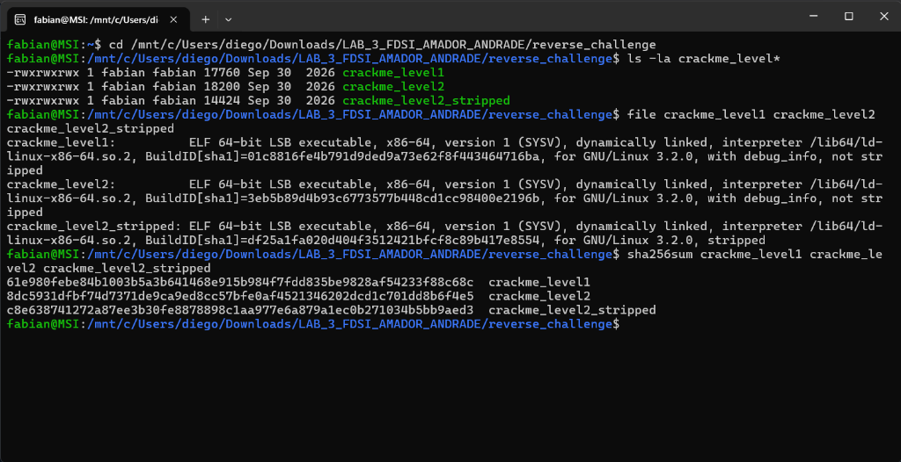
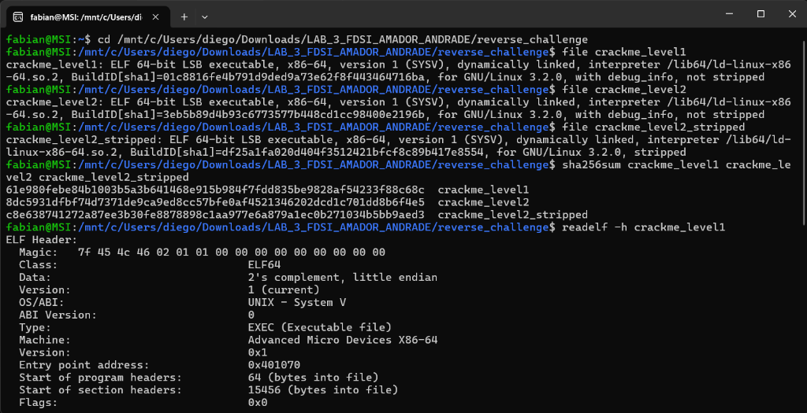
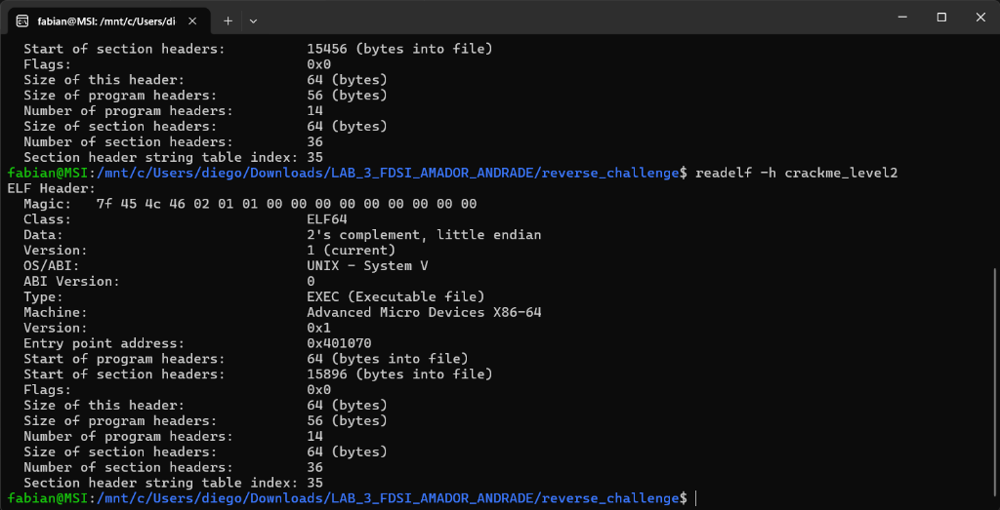
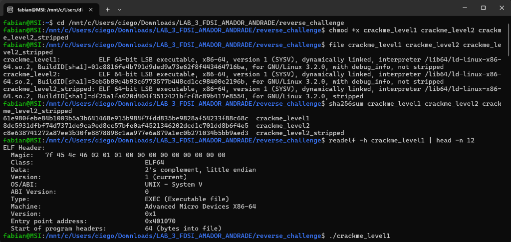
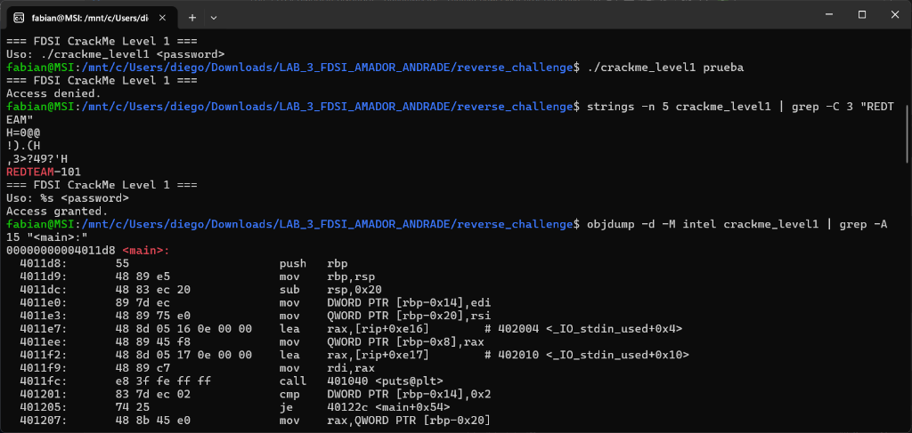
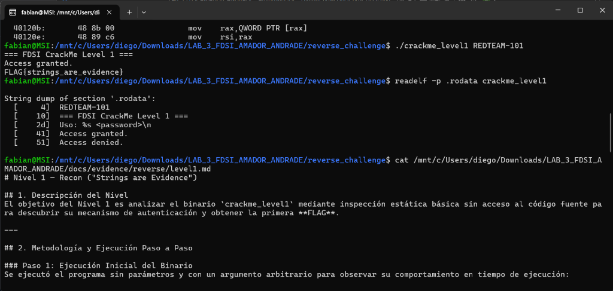
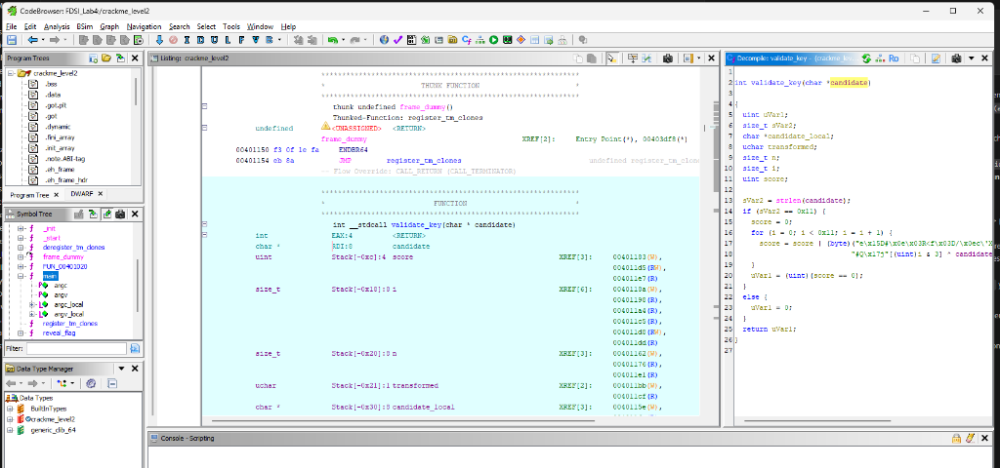
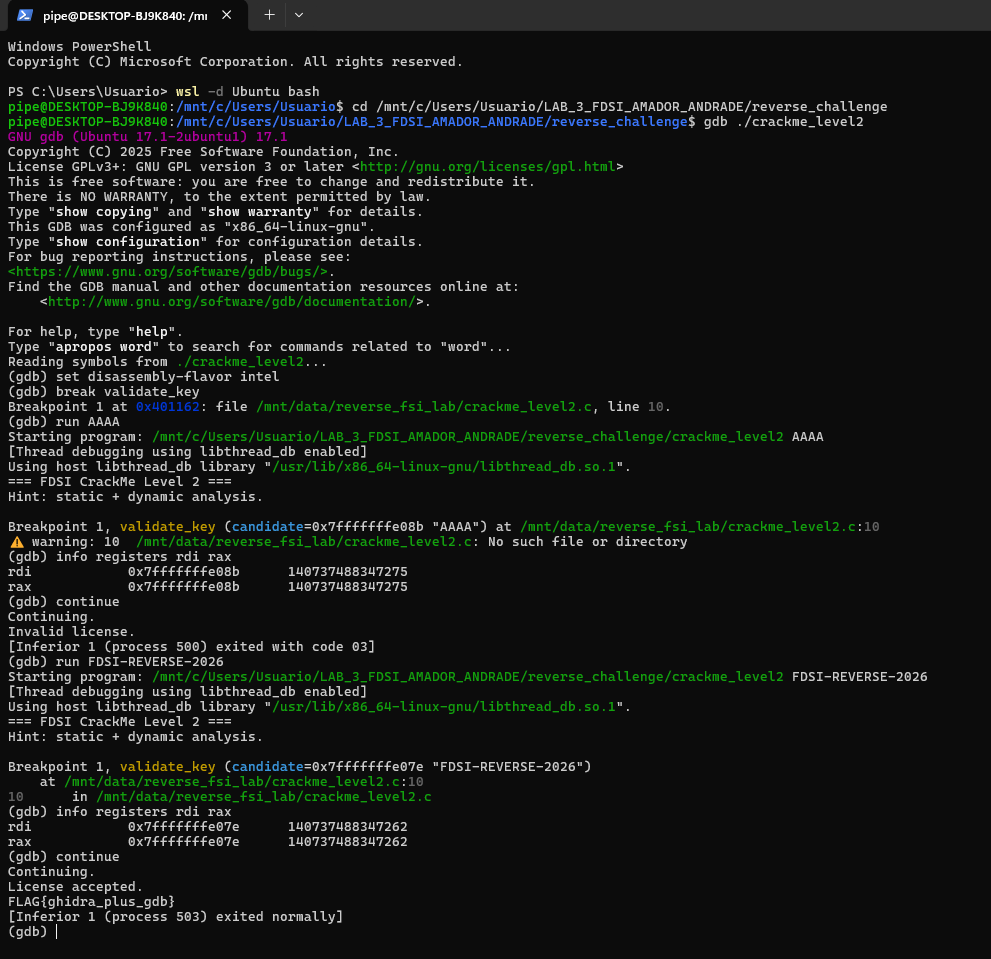
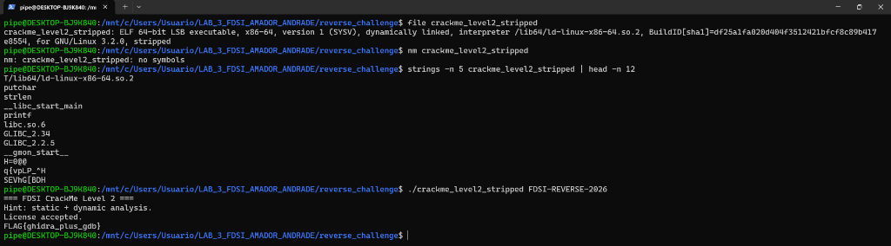

# Informe de Ingeniería Inversa y Análisis de Binarios (Reverse CTF Lab)

## 1. Resumen Ejecutivo y Baseline Forense

Este informe documenta el análisis de ingeniería inversa estático y dinámico realizado sobre tres ejecutables Linux ELF x86-64 (`crackme_level1`, `crackme_level2`, `crackme_level2_stripped`) en el marco del **Reverse Engineering Challenge Lab**.

### Baseline Forense de Integridad

| Archivo | SHA-256 Hash | Arquitectura / Tipo | Estado de Símbolos |
|---|---|---|---|
| `crackme_level1` | `61e980febe84b1003b5a3b641468e915b984f7fdd835be9828af54233f88c68c` | ELF 64-bit LSB executable, x86-64, dynamically linked | Not Stripped (Debug Info) |
| `crackme_level2` | `8dc5931dfbf74d7371de9ca9ed8cc57bfe0af4521346202dcd1c701dd8b6f4e5` | ELF 64-bit LSB executable, x86-64, dynamically linked | Not Stripped (Debug Info) |
| `crackme_level2_stripped` | `c8e638741272a87ee3b30fe8878898c1aa977e6a879a1ec0b271034b5bb9aed3` | ELF 64-bit LSB executable, x86-64, dynamically linked | Stripped (No Symbols) |



#### Encabezados ELF Identificados (`readelf -h`)




---

## 2. Nivel 1 — Recon ("Strings Are Evidence")

### 2.1 Inspección y Formulación de Hipótesis
Mediante la ejecución de `strings -n 5 crackme_level1`, se identificó la constante de texto `REDTEAM-101` almacenada en claro en la sección de datos del binario. El desensamblado con `objdump -d -M intel crackme_level1` reveló una llamada directa a `strcmp` comparando el parámetro ingresado por el usuario (`argv[1]`) con dicha constante.



### 2.2 Validación y FLAG
- **Comando de Verificación:** `./crackme_level1 REDTEAM-101`
- **Contraseña:** `REDTEAM-101`
- **FLAG Nivel 1:** `FLAG{strings_are_evidence}`



---

## 3. Nivel 2 — Reverse Engineering & Decompilador Ghidra

### 3.1 Análisis de la Lógica de Validación
El análisis del binario `crackme_level2` en Ghidra desveló que la clave no se almacena en texto plano. La rutina `validate_key` realiza los siguientes pasos:
1. Comprueba que la longitud de la cadena sea de 17 caracteres (`0x11` en `strlen`).
2. Aplica una transformación XOR byte a byte combinando el carácter ingresado `candidate[i]` con un elemento del arreglo de máscara de 4 bytes `k = [0x23, 0x51, 0x17, 0x6a]` indexado por `i % 4`.
3. Compara el byte resultante con un arreglo esperado de 17 bytes en `.rodata`: `expected = [0x65, 0x15, 0x44, 0x23, 0x0e, 0x03, 0x52, 0x3c, 0x66, 0x03, 0x44, 0x2f, 0x0e, 0x63, 0x27, 0x58, 0x15]`.



### 3.2 Pseudocódigo Reconstruido

```c
int validate_key(const char *candidate) {
    if (strlen(candidate) != 17) return 0;
    
    const unsigned char k[4] = {0x23, 0x51, 0x17, 0x6a};
    const unsigned char expected[17] = {
        0x65, 0x15, 0x44, 0x23, 0x0e, 0x03, 0x52, 0x3c,
        0x66, 0x03, 0x44, 0x2f, 0x0e, 0x63, 0x27, 0x58, 0x15
    };
    
    int score = 0;
    for (size_t i = 0; i < 17; i++) {
        unsigned char transformed = candidate[i] ^ k[i % 4];
        score |= (expected[i] ^ transformed);
    }
    return (score == 0);
}
```

### 3.3 Reconstrucción y FLAG
Al aplicar la inversa XOR (`candidate[i] = expected[i] ^ k[i % 4]`), se obtuvo la clave:
- **Clave Válida:** `FDSI-REVERSE-2026`
- **Comando de Verificación:** `./crackme_level2 FDSI-REVERSE-2026`
- **FLAG Nivel 2:** `FLAG{ghidra_plus_gdb}`

### 3.4 Confirmación Dinámica en GDB
Se ejecutó una sesión interactiva en GDB sobre `crackme_level2` en Ubuntu WSL2 para verificar el comportamiento de la CPU y los registros:
- **Caso `AAAA` (`Invalid license`):** `$rdi` contiene el puntero al buffer con 4 bytes, fallando la condición de longitud (`strlen == 17`) y retornando `$rax = 0`.
- **Caso `FDSI-REVERSE-2026` (`License accepted`):** `$rdi` apunta a los 17 bytes de la clave candidata, el bucle XOR evalúa diferencias en cero y retorna `$rax = 1`, liberando la bandera `FLAG{ghidra_plus_gdb}`.



---

## 4. Boss Level — Stripped Binary Analysis (`crackme_level2_stripped`)

### 4.1 Evidencia en Consola del Binario Stripped
A continuación se presenta la captura de la verificación en terminal de `crackme_level2_stripped`:



### 4.2 Desglose y Análisis Técnico de Comandos:

1. **`file crackme_level2_stripped`:**
   - **Salida:** `ELF 64-bit LSB executable, x86-64, dynamically linked, interpreter /lib64/ld-linux-x86-64.so.2, ..., stripped`.
   - **Explicación:** Confirma que el ejecutable es un binario ELF x86-64 y que ha pasado por el proceso de *stripping*, lo que descarta cabeceras de símbolos de depuración y tablas no requeridas por el cargador del sistema operativo.

2. **`nm crackme_level2_stripped`:**
   - **Salida:** `nm: crackme_level2_stripped: no symbols`.
   - **Explicación:** Demuestra formalmente que las secciones `.symtab` y `.strtab` fueron suprimidas. A diferencia del Nivel 2 original, utilidades de inspección estándar no pueden asociar direcciones de memoria con nombres de función como `validate_key`, `reveal_flag` o `main`.

3. **`strings -n 5 crackme_level2_stripped | head -n 12`:**
   - **Salida:** Muestra las dependencias dinámicas (`libc.so.6`), funciones importadas de biblioteca (`strlen`, `printf`, `putchar`) y mensajes del programa (`=== FDSI CrackMe Level 2 ===`, `Hint: static + dynamic analysis.`).
   - **Explicación:** Evidencia que el comando `strip` solo elimina símbolos de enlace/depuración, pero no cifra ni altera los literales de cadena almacenados en la sección `.rodata`.

4. **`./crackme_level2_stripped FDSI-REVERSE-2026`:**
   - **Salida:**
     ```text
     === FDSI CrackMe Level 2 ===
     Hint: static + dynamic analysis.
     License accepted.
     FLAG{ghidra_plus_gdb}
     ```
   - **Explicación:** Demuestra de forma concluyente que la lógica de validación algorítmica y la rutina de revelado de bandera residen intactas en las instrucciones del binario. Al proporcionar la clave derivada en el análisis estático (`FDSI-REVERSE-2026`), el control de flujo valida el algoritmo XOR y libera con éxito la bandera `FLAG{ghidra_plus_gdb}`.

### 4.3 Técnica de Análisis por Referencias y Offsets
- **Localización de `main`:** Al carecer de símbolo `main`, se rastrea el punto de entrada `_start` (`0x401060`), el cual pasa a `__libc_start_main` el puntero de la función de inicio en el registro `rdi` (dirección `0x4011d6`).
- **Localización de la rutina de validación:** Dentro de la función `0x4011d6`, se identifica la instrucción `call 0x401156` inmediatamente antes de la comparación de éxito, correspondiente a la lógica original de `validate_key`.
- **Depuración dinámica:** En GDB se fijan breakpoints absolutos por dirección de memoria (`break *0x401156`), permitiendo inspeccionar la ejecución incluso sin nombres simbólicos.

---

## 5. Módulo Comparativo: Burp Suite vs. Ghidra

| Característica | Ghidra / GDB / Binary Reverse | Burp Suite Community |
|---|---|---|
| **Capa de Análisis** | Código máquina / Ensamblador x86-64 / Memoria de procesos | Capa 7 (Aplicación / Protocolo HTTP/HTTPS) |
| **Objeto de Estudio** | Ejecutables compilados (ELF, PE, Mach-O) | Peticiones y respuestas HTTP en tránsito |
| **Herramientas Clave** | Decompilador, desensamblador, breakpoints, registros | Proxy interceptor, Repeater, Intruder, Decoder |
| **Propósito Principal** | Comprender la lógica interna, algoritmos y binarios sin código fuente | Analizar vulnerabilidades web (XSS, SQLi, CSRF, IDOR) |

---

## 6. Preguntas de Análisis Oficiales

### 1. ¿Qué información pudiste obtener sin ejecutar el binario?
Mediante análisis estático preliminar con `file`, `sha256sum`, `readelf`, `strings`, `objdump` y decompilación en `Ghidra` se extrajo:
- **Metadatos y Arquitectura:** Formato ejecutable ELF de 64 bits para arquitectura x86-64, orden de bytes *little-endian*, enlazado dinámico con `libc.so.6`, intérprete del sistema `/lib64/ld-linux-x86-64.so.2` y presencia de símbolos DWARF.
- **Hashes de Integridad:** Identificación criptográfica única (SHA-256) de cada archivo para garantizar reproducibilidad y auditoría forense.
- **Cadenas de Texto Embebidas (`.rodata`):** En el Nivel 1 se extrajo la contraseña en texto plano (`REDTEAM-101`) y mensajes de interfaz; en el Nivel 2 se identificaron los mensajes de consola y llamadas a funciones de biblioteca estándar (`strlen`, `printf`, `putchar`).
- **Tabla de Símbolos:** Nombres y direcciones de funciones críticas (`main`, `validate_key`, `reveal_flag`).
- **Estructura y Algoritmo de Validación:** Se identificó la condición estricta de longitud (`strlen == 17` / `0x11`), la máscara cíclica de 4 bytes (`k = [0x23, 0x51, 0x17, 0x6a]`), el arreglo esperado de 17 bytes (`expected`) y la operación `(candidate[i] ^ k[i % 4]) ^ expected[i] == 0`, permitiendo despejar y derivar la clave matemáticamente antes de iniciar cualquier ejecución.

### 2. ¿Por qué una contraseña compilada como string es un diseño inseguro?
Porque en los lenguajes compilados tradicionales (como C o C++), los literales de cadena se almacenan directamente en las secciones de solo lectura (`.rodata`) o datos (`.data`) del binario compilado sin ninguna capa de cifrado:
1. **Facilidad Trivial de Extracción:** Cualquier usuario o atacante puede extraer los secretos en segundos utilizando herramientas elementales como `strings`, visores hexadecimales o `readelf -x .rodata`, sin necesidad de depurar, desensamblar ni ejecutar el archivo.
2. **Violación del Principio de Kerckhoffs:** La seguridad de un sistema no puede basarse en asumir que el usuario no abrirá el archivo binario (*Security by Obscurity*). El software distribuido al cliente se encuentra en un entorno de hostilidad no confiable donde el usuario tiene control total sobre la memoria y el almacenamiento.

### 3. ¿Qué cambió entre `crackme_level2` y `crackme_level2_stripped`?
- **Remoción de Metadatos de Depuración y Símbolos:** El proceso de *stripping* (`strip`) eliminó permanentemente las secciones `.symtab` (Symbol Table) y `.strtab` (String Table).
- **Impacto en Herramientas de Análisis:**
  - `nm crackme_level2_stripped` devuelve `no symbols`.
  - GDB no puede resolver nombres de función (`Function "validate_key" not defined`).
  - Ghidra no cuenta con identificadores simbólicos y asigna nombres genéricos por dirección (`FUN_00401156`).
- **Lo que NO cambió:** El código máquina, los opcodes x86-64, la lógica del bucle XOR, los datos en `.rodata` y el comportamiento del programa permanecen idénticos. Para analizarlo, se utilizó navegación por flujo de control desde `_start` (`0x401060`) pasando por el argumento `rdi` de `__libc_start_main` (`0x4011d6`), y puntos de interrupción en GDB por dirección de memoria (`break *0x401156`).

### 4. ¿Qué ventaja tuvo Ghidra sobre `objdump`?
1. **Decompilación a C de Alto Nivel:** Mientras que `objdump` únicamente ofrece el desensamblado en mnemónicos de ensamblador x86-64 (`mov`, `cmp`, `jb`, `xor`), Ghidra reconstruye el algoritmo a pseudocódigo legible en C con estructuras de control de alto nivel (`for`, `if/else`, arrays).
2. **Inferencia y Renombrado Dinámico:** Ghidra infiere tipos de datos (`char*`, `size_t`, `uint`) y permite renombrar dinámicamente variables y argumentos en la interfaz (`candidate`, `score`, `i`), propagando la claridad en todo el análisis.
3. **Referencias Cruzadas (XREFs):** Ghidra mapea instantáneamente en qué partes del binario se llama o referencia cada función, literal o dirección de memoria.
4. **Grafo de Flujo de Control Visual (CFG):** Permite inspeccionar interactivamente las bifurcaciones y ramas de salto condicional del código.

### 5. ¿Qué confirmó GDB que el análisis estático por sí solo no demostraba?
1. **Estado Real de Registros y CPU:** GDB comprobó en memoria y tiempo real el estado exacto de los registros: `$rdi` apuntando a las cadenas en el stack y `$rax` recibiendo el resultado booleano (`0` para clave inválida, `1` para clave aceptada).
2. **Comportamiento Dinámico de Saltos Condicionales:** Demostró el recorrido en vivo del programa: ante la clave fallida `AAAA`, evaluó la longitud de 4 bytes contra 17 (`0x11`), tomando la rama de fallo (`Invalid license`); ante `FDSI-REVERSE-2026`, recorrió las 17 iteraciones XOR sin acumular diferencias en `score` y activó la llamada a `reveal_flag()`.
3. **Verificación Experimental Libre de Suposiciones:** Permitió validar empíricamente que la clave calculada funcionaba de manera efectiva en el entorno real de ejecución de la máquina host.

### 6. ¿Por qué Burp Suite no es una herramienta de ingeniería inversa de binarios?
Porque Burp Suite es un proxy de aplicación web diseñado para interceptar, modificar y analizar tráfico HTTP/HTTPS en la capa de red/aplicación, mientras que la ingeniería inversa de binarios analiza instrucciones binarias compiladas a nivel de procesador y memoria local.

### 7. ¿Qué controles de desarrollo evitarían embebidos inseguros de secretos en software real?
- Nunca almacenar secretos o claves criptográficas en el cliente.
- Implementar verificación de licencias basada en servidores remotos mediante HTTPS con autenticación asimétrica (firmas RSA/ECDSA o JWT).
- Aplicar *stripping* de símbolos y ofuscación de código en compilaciones de producción.
- Utilizar módulos de hardware seguro (HSM / TPM) o bóvedas de claves (Vault) para el manejo de secretos.

---

## 7. Guía de Sustentación en Vivo (3 Minutos por Equipo)

Para la presentación de 3 minutos ante el docente, siga este guión estructurado:

1. **Qué observamos inicialmente (0:00 - 0:40):**
   - Ejecutamos `file` y `sha256sum` en los binarios ELF x86-64. En el Nivel 1, con `strings` identificamos la clave `REDTEAM-101` y obtuvimos la `FLAG{strings_are_evidence}`.
2. **Qué hipótesis formulamos (0:40 - 1:15):**
   - En el Nivel 2, la clave ya no era visible en texto plano. Formulamos la hipótesis de que existía un bucle XOR que transformaba los bytes del input contra una clave repetitiva de 4 bytes.
3. **Qué función o condición encontramos (1:15 - 1:55):**
   - En Ghidra y `objdump` identificamos `validate_key()`, que exigía una longitud exacta de 17 bytes (`0x11`) y comparaba `candidate[i] ^ k[i % 4]` contra la matriz `expected`. Revertimos la operación XOR derivando la clave `FDSI-REVERSE-2026`.
4. **Cómo la confirmamos en ejecución (1:55 - 2:30):**
   - En GDB fijamos un breakpoint en `validate_key` (y por dirección `*0x401156` en la versión *stripped*). Confirmamos que con `AAAA` el programa retornaba `0` y fallaba, mientras que con `FDSI-REVERSE-2026` el registro `$rax` retornaba `1`, liberando la `FLAG{ghidra_plus_gdb}`.
5. **Qué enseñanza de desarrollo seguro obtenemos (2:30 - 3:00):**
   - Aprendimos que la ofuscación local o la verificación de secretos en binarios cliente es insegura (*Security by Obscurity*). Los secretos deben ser validados en servidores remotos autenticados mediante cifrado asimétrico.
